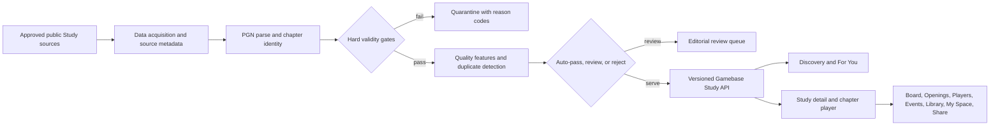
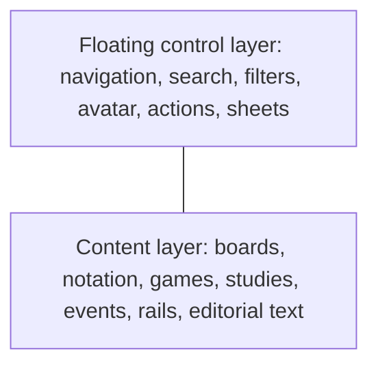
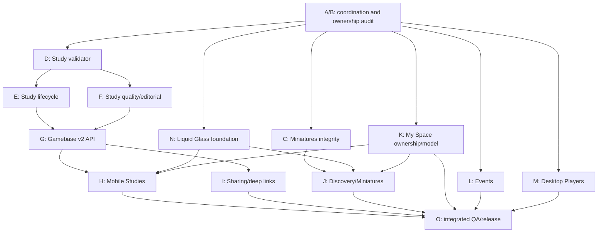

# ChessEver v2 Master Handoff

**Purpose:** Single source of truth for the v2 product modernization, data quality work, desktop Player Workspace, and parallel agent execution.

**Status:** Planning and discovery. No production implementation is authorized by this document alone.

**Primary repositories:**

- `/Users/berkay/projects/chessever-frontend` — Flutter mobile/frontend
- `/Users/berkay/projects/chessever_frontend_desktop` — desktop shell, Players workspace, local opening-tree tooling
- `/Users/berkay/projects/chessever_gamebase` — canonical game, miniature, study, evaluation, and player-data API
- `/Users/berkay/projects/chessever_data_hub_monorepo` — ingestion, live event synchronization, source orchestration, and operational data jobs
- `/Users/berkay/projects/obsidian/mindmap/Chessever` — product notes and prior decisions

Do not put passwords, API keys, database URLs, SSH commands containing secrets, or private account details in this file. Use secret-manager references and environment-variable names only.

---

## 1. Product outcome

ChessEver v2 should feel like a polished personal chess media and preparation environment:

1. **For You** is the default landing experience.
2. **Discovery** presents useful, high-quality Miniatures and Studies in an editorial, Netflix-like browsing experience.
3. **My Space** is a personal bookmarkable workspace for games, events, Studies/chapters, folders, databases, progress, and likes.
4. **Events** focuses on upcoming, current, and past events; Calendar moves to the desktop/sidebar context.
5. **Players** on desktop helps a user prepare against a player by combining games from ChessEver, Chess.com, and Lichess, then building a navigable opening tree.
6. Liquid-glass modernization improves hierarchy, navigation, floating controls, sheets, bottom navigation, and desktop panels without sacrificing content clarity, accessibility, or performance.

The project must improve the usefulness and trustworthiness of content, not merely make the interface look newer.

---

## 2. Source material and decisions

### 2.1 Meeting notes

Primary source:

`/Users/berkay/Downloads/06.05.2026 ChessEver_v2_Meeting.docx`

The meeting established:

- v2 navigation: Events, For You, Library, Discovery, and MySpace
- Discovery: Miniature games, Lichess Studies, Most Liked Games, and My Likes
- MySpace: bookmarkable personal space with drag-and-drop customization for premium users
- free access to Miniatures, Studies, Likes, and Tags; premium access to discovery filtering/search and MySpace content/customization
- Calendar moved to the sidebar
- desktop Player Workspace and opening-tree improvements
- tree transposition handling, top lines, games below notation, and fewer panel switches
- folder/database terminology rename
- PiP as a free feature
- tag privacy rules and public/private content boundaries

The meeting’s popularity language must be reconciled with the actual backend. A claim such as “100 likes” must not be implemented unless a reliable likes signal exists. Current study discovery code uses Lichess views plus a credibility score.

### 2.2 Obsidian notes

Relevant notes:

- `/Users/berkay/projects/obsidian/mindmap/Chessever/Library Redesign — Frontend Spec.md`
- `/Users/berkay/projects/obsidian/mindmap/Chessever/Library Redesign — Backend Spec.md`
- `/Users/berkay/projects/obsidian/mindmap/Chessever/Notes.md`
- `/Users/berkay/projects/obsidian/mindmap/Chessever/Coolify(gamebase).md`

Use these notes for Library tabs, My Likes, Discovery, Miniatures, studies, local imports, smart events, and future content/product constraints. Treat implementation code and current API contracts as authoritative when a note conflicts with reality.

### 2.3 Existing frontend handoff

The local Grok Build archive was found under:

```text
/Users/berkay/.grok/sessions/%2FUsers%2Fberkay%2Fprojects%2Fchessever-frontend/019f4adb-a04d-7c72-a6fa-28b2c5a866bc
```

Its title is “Redesign Mobile App with Liquid Glass Floating Islands.” The durable source files are:

- `chat_history.jsonl` — full local conversation history
- `compaction/segment_000.md` — verbatim compacted rollout segment
- `compaction/INDEX.md` — compacted-segment index
- `summary.json` — session metadata

This is a historical source archive and must not be modified. It records work on `feature/liquid-glass-redesign`; agents must verify the current branch and repository state instead of assuming the historical head is still active.

The redesign should preserve the accepted intent of that conversation while expanding it into the complete v2 product/data task. Do not lose the original visual requirements, but connect every visual surface to a real data contract and loading/error state.

### 2.4 Accepted user directive ledger

This is the sanitized, normalized list of current owner directives. The local Grok archive above contains the original verbatim frontend conversation. Superseded/canceled proposals and plaintext credentials are intentionally excluded.

1. Recover the latest local Grok Build CLI task from the `chessever-frontend` project and make the unfinished intent transferable to another agent.
2. Preserve the completed/partial liquid-glass redesign findings, including floating islands, package composition rules, Cue/Motor search motion, and Apple Music-style searchable bottom navigation.
3. Use the v2 Obsidian notes and the downloaded Google Meet/Opus meeting summary as product sources.
4. Keep every active v2 task, dependency, acceptance criterion, and agent handoff in one master file suitable for a parallel coding-agent fleet.
5. Make For You/My Space feel like an intelligent Netflix-style home with smart events, Miniatures, Studies, saved content, and continue/resume experiences.
6. Treat Miniatures and Studies as capabilities already living in Gamebase and/or Data Hub; verify exact production ownership before changing the pipeline.
7. Treat the working desktop Miniatures implementation as the behavioral baseline and make mobile parity complete, touch-native, and reliable.
8. Treat the current Studies implementation as inadequate until content is accurate, playable, beneficial, quality-gated, and operationally trustworthy.
9. Make Studies interoperable with Board, Opening Explorer/tree, Players, Events, canonical games, Library, My Space, progress/resume, offline snapshots, and global discovery.
10. Make Study/Chapter/position sharing and deep links work end to end, including source attribution and web fallback.
11. Preserve and improve the desktop Players preparation workspace: combine ChessEver, Chess.com, and Lichess games safely and build a correct, usable opening tree.
12. Never use a permanent sticky top area. Pages are full-screen canvases; search, tabs, avatar circles, filters, actions, and bottom navigation float above content.
13. Use one coherent, non-distracting, animated Liquid Glass control language while keeping chess content crisp.
14. Design light and dark modes separately and completely; neither is a simple inversion of the other.
15. Let the implementation agent exercise strong design judgment inside the product constraints, and permit image generation when it materially improves visual exploration or an approved asset.
16. Give the next agent full awareness of `liquid_glass_widgets` 0.21.3, its API, examples, composition constraints, quality/performance behavior, accessibility, and best use in ChessEver.
17. Split the program into safe parallel workstreams with explicit ownership, dependency gates, tests, handoff format, rollout, and definition of done.

### 2.5 Recovered Grok user-prompt inventory

The following is the complete content-level inventory recovered from the main Liquid Glass Grok session. Line breaks were normalized and screenshot placeholders were omitted; the archive in section 2.3 remains the verbatim source.

1. “We need a whole full redesign approach to our mobile app here. Let’s create a new worktree/branch and continue from there. We will use `liquid_glass_widgets` and turn our whole outer control widgets—bottom navbar, app bars, tabs—and app scaffolding toward the package’s offerings. Its pub.dev SDK must be read carefully because layout must follow package expectations. Modern outer controls no longer take rigid space: tabs, bottom navbar, and top bar are floating blurred liquid-glass islands that take only the space they need, leaving more room for the main view. Tabs can become floating chips after scroll, the bottom navbar shrinks while scrolling down and grows while scrolling up, and app-bar controls break into islands with blurred content behind them. Follow the package instructions and examples for a native-feeling implementation.”
2. “See how Apple Music’s search icon expands when tapped. Use Cue and Motor for a unique, beautiful widening-forward and widening-back transition.”
3. “When I am at the top-most page position or scroll up, the bottom Liquid Glass navbar must grow back.”
4. “Page titles such as Favorites and Countrymen must be compact liquid chips beside the top-left back button; do not let a title consume a whole row.”
5. “We do not want traditional sticky tabs. When scrolled, tabs become floating liquid chips so there is no dead space; all pages use island-style top controls.”
6. “Use the package’s search capabilities. First expand search; only on the next tap open a dedicated full search page like Apple Music, with liquid-glass Players and Events tabs.”
7. “The first tap expands the search icon into a Liquid Glass input. The second tap smoothly fades in the dedicated search page, focuses the keyboard, and starts search there.”
8. “Have we updated all pages?”
9. “Get all pages done.”

### 2.6 Recovered Liquid Glass implementation handoff

The historical branch is present locally as `feature/liquid-glass-redesign`. Its latest committed sequence is:

```text
bd54d938  two-tap search: expand, then fade into dedicated page
4396baf9  dedicated Liquid Glass Players/Events search page
8ffe169a  floating liquid tab chips instead of sticky segments
3a000a8f  compact glass title chips beside the back button
67ab7b3a  bottom glass nav grows at top and on scroll-up
11bda4d5  refined Cue/Motor Apple Music search motion
5bfb39e7  Cue sizedClip + Motor spring search widening
8260e0c1  full package surface via glass_kit
5e77317f  compact bottom-nav hit-overlay correction
```

Recovered completed/partial implementation:

- root `LiquidGlassWidgets.initialize`/`wrap` and separate light/dark glass themes
- shared `glass_kit` adapters and `PACKAGE_SURFACE.md`
- compact top islands, title chips, back/avatar/filter controls, and floating segment behavior on many existing screens
- compact searchable bottom island, scroll shrink/grow, correctly bounded hit targets, and package-owned morph physics
- Cue/Motor motion presets and two-tap search behavior
- dedicated Players/Events search destination
- real `themeMode` wiring and settings treatment
- focused unit/widget/structure tests that passed at the historical commits

Not proven complete by that session:

- user-run visual/device verification against the Apple Music references
- all v2 navigation/data semantics in this document
- five-destination target navigation at small widths
- Studies, My Space progress, smart rails, and the other backend-dependent verticals
- compatibility of current uncommitted user changes with the historical tests

Agents must build on these commits and current files, not reimplement the same design from scratch. They must also preserve current uncommitted user work and rerun scoped validation after integration.

---

## 3. Repository and ownership map

### 3.1 `chessever_gamebase` is the current canonical content API

Current evidence shows that Gamebase already owns the implementation for Miniatures and Studies:

- `src/routers/miniatures.router.ts`
- `src/controllers/miniatures.controller.ts`
- `src/services/miniature.service.ts`
- `src/utils/miniature-qualification.ts`
- `src/routers/studies.router.ts`
- `src/services/lichess-study-sync.service.ts`
- `src/utils/credibility.ts`
- `docs/library-api-frontend-guide.md`
- `prisma/schema.prisma`

The Gamebase schema includes:

- `game`
- `game_position`
- `game_position_deep`
- `game_miniature`
- `lichess_study`
- `lichess_study_chapter`
- player and source metadata

The Gamebase REST API is the frontend-facing contract. Existing documentation identifies:

- `GET /api/studies`
- `GET /api/studies/facets`
- `GET /api/studies/:id`
- `GET /api/studies/:id/chapters/:chapterId/pgn`
- `POST /api/studies/refresh`
- `GET /api/miniatures`

The frontend must use the existing envelope, pagination, authentication abstraction, nullability, and error semantics. Do not invent a second Miniatures/Studies API in the mobile repository.

### 3.2 `chessever_data_hub_monorepo` is the ingestion and live-data source

The Data Hub currently orchestrates Lichess broadcast discovery, live workers, PGN parsing, source synchronization, event normalization, and pushes into the shared database. It includes:

- `main_data_hub.py`
- `fast_detector.py`
- Lichess API clients
- Chess.com-related ingestion modules
- live worker orchestration
- event and broadcast normalization
- operational services and timers

Data Hub is the established acquisition/orchestration system for live events, broadcasts, and several game sources. Study discovery/synchronization, however, currently exists in Gamebase. Do not move code merely to make the architecture diagram look cleaner. The ownership audit must choose and document one operational owner per source path, while Gamebase remains the canonical serving/qualification API.

### 3.3 Ownership rule for Miniatures and Studies

The master ownership rule is:

```text
External sources
    -> verified owning acquisition path (Data Hub or Gamebase)
    -> Gamebase normalization and quality qualification
    -> Gamebase API
    -> Mobile and desktop clients
```

Before implementation, an agent must verify the exact write path in production and document it. The UI team must not query raw source tables or scrape Lichess directly.

---

## 4. Miniatures: accurate, useful, and trustworthy content

### 4.1 Current definition

Gamebase currently models Miniatures as a derived view over games. The qualification path is based on:

- decisive result only; draws are excluded
- game ends by move 25 or earlier
- game lasts more than two full moves
- final position is decisive for the recorded winner
- checkmate qualifies directly
- otherwise final-position evaluation must meet the configured decisive threshold
- malformed, incomplete, or unreplayable games must be rejected

The derived row is stored in `game_miniature` and the source game is marked with a `miniature_checked` watermark for incremental processing.

### 4.2 Quality requirements

Miniatures must be content people can study, not random short games. Every served miniature should have:

- valid and replayable move data
- stable source identity and deduplication
- correct result and final position
- correct player names, ratings, event, date, source, and time control when available
- a clear reason for qualification: checkmate or decisive final position
- consistent white-perspective evaluation semantics
- enough metadata for filtering by player, event, rating, opening, ECO, result, and time control
- graceful handling when source metadata is incomplete
- provenance suitable for debugging and correction

The pipeline must distinguish:

- true decisive miniatures
- short draws
- short games that ended from resignation but are not positionally decisive
- corrupt PGNs
- duplicate games
- games with wrong or missing final FEN
- games whose source metadata later changes

### 4.3 Required validation work

Agents working on Miniatures must add or verify:

1. Replay tests from representative PGNs, including custom starting positions.
2. Checkmate-result agreement tests.
3. Non-checkmate engine-threshold tests for both white and black wins.
4. Draw exclusion tests.
5. Move-25 boundary tests.
6. Corrupt-PGN and missing-FEN rejection tests.
7. Duplicate and source-identity tests.
8. Reprocessing tests when a source game is corrected.
9. API tests for date windows, pagination, sorting, player filters, and null fields.
10. Regression tests proving that an invalid miniature cannot remain served after requalification.

### 4.4 Product presentation

Discovery should offer:

- Today, Week, and All-time views
- strongest first by default
- quickest decisive wins as an alternate sort
- recent games
- player, event, opening, ECO, result, rating, and time-control filters
- a compact preview card with result, move count, players, ratings, event, date, and opening
- one-tap open into the full game
- explanation of why the game is a miniature where useful

The UI must not oversell the content. If a game is incomplete or metadata is uncertain, the backend should exclude it or mark the uncertainty explicitly.

### 4.5 Desktop baseline and mobile parity

Miniatures are already implemented and working in the desktop project at:

`/Users/berkay/projects/chessever_frontend_desktop`

The desktop implementation is the behavioral reference for mobile. Mobile should reach feature and data parity, not a simplified placeholder version. Agents must compare the desktop repository’s miniature repository/provider, filters, card mapping, loading states, sorting, pagination, and game-opening behavior against the mobile implementation.

Parity means:

- the same Gamebase source and response semantics
- the same miniature qualification meaning
- equivalent Today/Week/All-time windows
- equivalent sorting and filtering where the mobile form factor permits
- equivalent player, result, rating, time-control, opening, and event metadata
- equivalent full-game navigation
- equivalent empty, loading, error, offline, and stale-data behavior
- mobile-specific interaction design without changing product meaning

The desktop UI must not be copied pixel-for-pixel. Its working data flow and behavior should be reused; mobile should express the same capability through touch-first cards, sheets, gestures, and responsive layouts.

---

## 5. Studies: a complete learning product, not a raw feed

### 5.1 Honest current-state finding

The existing work is a useful ingestion foundation, but it is **not yet a quality Studies product**. Future agents must not describe this vertical as complete merely because records exist in Gamebase.

| Capability | Current evidence | v2 verdict |
|---|---|---|
| Discovery | Gamebase scrapes Lichess’s public trending-study HTML pages | Narrow and scraper-dependent |
| Source retrieval | Gamebase exports chapter PGNs through the Lichess API | Useful foundation |
| Storage | `lichess_study` and `lichess_study_chapter` cache aggregate metadata and PGN | Useful foundation |
| Gate | `scoreStudy` uses views, chapter count, ply count, annotations, title sanity, and freshness | Too shallow to represent instructional quality |
| Validation | Mainline plies are counted with text stripping; chapters are not replayed through a legality-aware parser | Not sufficient |
| Lifecycle | `gone` is handled for a discovered 404; forbidden exports are skipped; absence from trending is not a complete lifecycle | Incomplete |
| API | List, facets, detail, chapter PGN, and refresh routes exist | Usable baseline, missing v2 fields and semantics |
| Mobile | No complete Study repository, provider, Discovery surface, detail screen, or chapter player was found | Must be built |
| Desktop | No complete Lichess Studies product was found; references to “study opening” are opening-explorer actions | Must be built or intentionally scoped |
| Tests | No meaningful automated Study test suite was found | Release blocker |
| Sharing | Existing game/book deep-link infrastructure does not route Study links | Must be built |

Current Gamebase behavior also has specific risks that the quality stream must address:

- an unchanged `lichessUpdatedAt` skips a study even when its scraped view count, rank, or score inputs changed
- a previously active study can remain active after export becomes forbidden
- studies that disappear from the scraped trending window do not have a robust absence/staleness lifecycle
- initial `lichessCreatedAt` is currently populated from the observed update timestamp, which must not be presented as a verified creation date
- chapter boundaries and fallback chapter IDs depend on PGN headers and synthetic IDs
- mainline ply count does not prove legal replay, valid variations, valid custom FEN, or result consistency
- the gate does not measure annotation depth, instructional coherence, duplicates, author trust, language, spam, or unsafe text
- there is no chapter content hash/version, ETag contract, editorial state, or reason-code audit trail
- `POST /api/studies/refresh` allows a client action to enqueue a global ingestion job; a user refresh must not have that meaning
- facets currently scan every served row and return values without counts

These are findings to fix, not reasons to discard the existing Gamebase implementation.

### 5.2 Product promise and primary use cases

A ChessEver Study should help a player learn or prepare. Every surfaced Study must have at least one explicit, machine-readable purpose:

- opening explanation or repertoire training
- annotated model games
- player or opponent preparation
- event or match review
- tactical exercises
- endgame instruction or practice
- interactive gamebook/practice
- thematic position collection

The product promise is:

> A user can understand why a Study is useful before opening it, trust that every served chapter works, continue the material inside ChessEver, and return to the exact place later.

Popularity can help discovery but cannot substitute for learning value. “Trending” and “high quality” are separate labels. Do not show a likes count when the source only supplies views, and never implement the meeting-note “100 likes” rule without a trustworthy likes signal.

### 5.3 Target pipeline and ownership



Gamebase remains the canonical frontend API and quality authority. Data Hub may own or assist external-source acquisition if the verified production write path supports that split. Mobile and desktop clients must never scrape Lichess or infer editorial quality independently.

### 5.4 Hard validity gates

Quality scoring happens **after** hard validation. No popularity or editorial override may make an invalid chapter playable.

#### Study-level hard gates

A Study is ineligible to serve when any of these is true:

- source identity is missing, malformed, duplicated, or cannot be traced to its origin
- source is deleted, private, forbidden for export, unsafe, or no longer permitted for redistribution
- title is empty, placeholder-only, spam, or misleading relative to the material
- no chapter survives validation
- the material cannot be represented faithfully in ChessEver’s supported chess rules
- the Study is a near-duplicate with no distinct instructional value
- required attribution or source URL is unavailable
- validation version is stale after a parser or rule upgrade

For the first quality release, reject the entire Study when any published chapter has a critical replay failure. A future partial-study mode may expose only valid chapters, but it must carry an explicit `partial` state, preserve source chapter ordering, and clearly disclose that some source material is unavailable.

#### Chapter-level hard gates

Each chapter must be processed by the same production-grade chess/PGN semantics used by the ChessEver Board. Validation must verify:

1. Header parsing and stable source chapter identity.
2. Supported variant and starting-position semantics.
3. `SetUp` and FEN validity, including side to move, castling, en-passant, and move counters.
4. Legal replay of the full main line from the correct initial position.
5. Legal replay of every included variation from its branch point.
6. Preservation and safe parsing of comments, NAGs, arrows/circles when supported, and gamebook prompts.
7. Result/header consistency where a result is present.
8. Real move substance; headers or comments alone do not qualify.
9. Deterministic ply, variation, comment, and annotation counts from the parsed tree.
10. Bounded payload size, tree depth, annotation size, and variation fan-out to protect clients.
11. Safe text normalization without deleting meaningful chess notation or non-English content.
12. Stable content hash and validation version.

Store validation status and reason codes separately from public metadata. Suggested internal states are `pending`, `valid`, `quarantined`, `unsupported`, `gone`, and `forbidden`.

### 5.5 Quality model and editorial control

The current credibility score must be replaced or versioned. The v2 model must separate objective validity, inferred learning value, popularity, and human editorial decisions.

After hard gates pass, compute explainable features such as:

- annotation depth: meaningful comments, NAGs, and variations per chapter and per move
- instructional structure: chapter naming, sequencing, repeated theme, and gamebook prompts
- substance: legal plies, useful branches, chapter completion, and non-trivial positions
- coherence: whether title, openings, players, and actual chapter content agree
- interactivity: valid gamebook/practice content and actionable prompts
- provenance: author/source stability and trusted or reviewed creator signals
- uniqueness: duplicate and near-duplicate similarity against already served material
- metadata quality: language, content type, ECO/opening, player/event links, and summary
- popularity: views or source rank, clearly named and capped so it cannot dominate
- freshness or evergreen value: recent improvement versus durable classic material

An initial scoring hypothesis may be used to build the review tool, but production weights and thresholds must be calibrated against a labeled set. A useful starting allocation is instructional depth 25, substance 20, coherence 15, interactivity 10, provenance 10, uniqueness 8, popularity 5, freshness/evergreen 4, and metadata quality 3. These numbers are **not approved production truth** until reviewers measure precision and false rejection.

Required internal decision fields:

- `qualityModelVersion`
- `qualityScore`
- `qualityTier`
- `qualityReasonCodes[]`
- `editorialState`: `unreviewed`, `auto_pass`, `needs_review`, `editorial_pick`, `rejected`
- `editorialNote` and reviewer audit fields, private to staff
- `contentType[]`, `language`, and `difficulty` with confidence or provenance
- `duplicateOfStudyId` or duplicate-group identity when applicable
- `validatedAt`, `validationVersion`, `contentHash`, and `lastSeenAt`

Public UI should translate approved positive reason codes into useful labels such as “Deep annotations,” “Interactive practice,” or “12 model games.” It must not expose raw scores, rejection internals, or unsupported claims.

### 5.6 Acquisition, synchronization, and lifecycle corrections

The ingestion agent must make the pipeline deterministic and recoverable:

- keep Lichess requests serialized and compliant with source limits
- use trending discovery as one input, not a permanent definition of all valuable content
- evaluate curated seeds, trusted authors, and gap-filling searches for openings/endgames only after source permissions and API behavior are verified
- capture `firstSeenAt`, `lastSeenAt`, source rank, view observation time, and discovery channel
- refresh popularity/metadata independently from expensive PGN downloads
- skip chapter re-download only when a trusted content version/hash proves it is unchanged
- periodically force a complete replay/validation using the current validator version
- mark 403/forbidden material non-servable immediately; do not leave an older active copy in discovery
- mark 404/deleted material `gone` and remove it from lists while allowing a graceful “no longer available” client state
- apply a consecutive-miss policy to studies no longer present in discovery, rather than deleting on one scrape failure or serving forever
- never invent a creation timestamp; use `null` or an explicitly named observed timestamp when creation is unknown
- replace chapters transactionally and publish a new content version only after the complete Study passes
- retain the previous good version until the new version validates, then invalidate caches atomically
- coalesce manual/admin sync requests and retain the existing distributed lock
- make the ingestion trigger admin/operations-only; mobile pull-to-refresh should re-fetch served API data, not enqueue a global source crawl
- alert when page-one discovery is empty, scrape shape changes, sync age exceeds target, quarantine rate spikes, or all items disappear

### 5.7 Discovery, detail, and chapter-player UX

#### Discovery

Studies should appear as an editorial home page, not a database table. Use horizontal rails with meaningful, non-overlapping intent, for example:

- Editorial Picks
- Best for Opening Training
- Annotated Model Games
- Interactive Gamebooks
- Endgames You Can Practice
- Prepare for Featured Players
- From Current Events
- Recently Improved
- Continue Studying

Rail membership must come from real metadata or editorial assignments. Do not manufacture a rail from a title keyword alone. Avoid showing the same Study repeatedly; apply cross-rail deduplication while allowing one clearly intentional hero placement.

Cards should show only decision-useful facts: title, author/source attribution, content type, chapter count, primary opening/player/theme, annotation or gamebook badge, difficulty when trustworthy, and freshness. A card image should be a deterministic rendering of a real chapter position or an approved editorial asset; never use a fabricated chess position as if it were Study content.

Search and filters come from Gamebase facets and indexed fields. Results need initial-loading, incremental-loading, refreshing, stale-cache, offline, empty-filter, and recoverable-error states.

#### Study detail

The detail page must include:

- title, author, source attribution, concise value proposition, content tags, and updated time
- chapter list with progress, chapter type, opening/players, and duration proxy such as legal ply count
- “Continue” at the last valid Study/chapter/ply position
- bookmark to My Space
- share actions
- original-source link
- explicit handling for changed, partial, removed, or unsupported material

The title and actions must live in floating glass islands over a full-screen content canvas; there is no permanent sticky header band.

#### Chapter player

The chapter experience must faithfully support:

- board, notation tree, comments, NAGs, and variations
- custom starting positions and supported variants
- chapter navigation without throwing away board state
- gamebook/practice mode when the source supports it
- current-ply resume state per user
- next/previous chapter and chapter picker
- “Analyze on Board,” “Explore this opening,” “Save to Library,” and sharing
- responsive phone, tablet, and desktop layouts
- offline use of an explicitly downloaded/cached snapshot

The client must never silently flatten variations, remove annotations, replace the custom start position, or treat a Study chapter as a normal game when doing so changes meaning.

### 5.8 Interoperability with ChessEver features

| Destination | User action | Required contract | Important rule |
|---|---|---|---|
| For You | Recommend or continue a Study | content types, quality tier, progress, user interests | Recommendations must remain explainable and diverse |
| Global Search | Find title, opening, player, event, author, or theme | indexed normalized fields plus facet counts | Do not perform full-dataset filtering on device |
| My Space | Bookmark a Study or a specific chapter | stable Study/chapter reference, order, item type | Bookmark is a live reference; removed sources get a graceful tombstone |
| Library | Save a chapter for offline/editable analysis | immutable PGN snapshot plus provenance and source version | A snapshot is distinct from the live Study reference |
| Board/Analysis | Continue from chapter or current ply | complete PGN tree, start FEN, current node identity | Preserve comments, variations, NAGs, and orientation |
| Opening Explorer | Explore the current position or chapter line | normalized FEN and move path | Do not reduce a custom position to the standard start |
| Desktop tree | Build/examine a tree from selected chapters | selected legal main lines, provenance, deduplication | Study material remains separate from opponent-game datasets unless explicitly combined |
| Players | Open a linked player or prep context | canonical player IDs and source-name aliases | Never link by display-name equality alone |
| Events | Open a linked event/game | canonical event/game IDs with confidence | Uncertain text matches are not public links |
| Miniatures/games | Open the canonical source game when a chapter maps to one | source game identity or verified game fingerprint | Do not create duplicate game records just for a Study chapter |
| Likes and Tags | Like/tag an underlying public game | canonical public game ID | Study-level likes are a separate product decision; do not overload game likes |
| Offline | Download selected Study/chapter | versioned snapshot, size, timestamp, invalidation policy | Show whether the user is viewing a snapshot or current source |
| Share | Share Study, chapter, position, or allowed PGN | canonical URL, version, source attribution | Sharing is not a substitute for private-content permissions |

### 5.9 Sharing and deep-link contract

Study sharing must reuse the reliability patterns already present for games and Library items.

Canonical public routes:

```text
https://chessever.com/studies/{studyId}
https://chessever.com/studies/{studyId}/chapters/{chapterId}
https://chessever.com/studies/{studyId}/chapters/{chapterId}?ply={zeroBasedPly}&v={contentVersion}
```

Custom-scheme equivalents may be supported for installed-app routing, but the HTTPS URL is canonical. `DeepLinkService` must parse cold-start and warm-start links, wait for app readiness, fetch the Study through Gamebase, validate the requested chapter and ply, and route to the nearest valid state. If the shared content version changed, the app should explain that the source was updated and open the current chapter rather than failing silently.

The share menu should support, when valid and permitted:

- Share Study
- Share Chapter
- Share Current Position
- Copy Link
- Share or export chapter PGN
- Open Original Source

Share payloads must include the Study/chapter title, ChessEver URL, and source attribution without leaking private notes, user progress, API keys, or account identifiers. Public Lichess Studies do not require ChessEver share tokens. Future private/native Studies must use explicit permission and revocable-token semantics.

Web fallback pages need Open Graph/Twitter metadata, a useful title/description, source attribution, and an app-open path. A chapter-position preview may render a real board position from the referenced version; generated or approximate positions are forbidden.

Required share tests:

- Study, chapter, and exact-ply URL generation
- URL encoding and malformed ID rejection
- cold-start and warm-start deep-link routing
- missing, gone, forbidden, changed-version, and out-of-range-ply behavior
- Android/iOS share-sheet invocation through `share_plus`
- web fallback and social crawler metadata
- source attribution and PGN export permission
- no private progress or notes in payloads/analytics

### 5.10 Entitlements, privacy, and analytics

Per the v2 meeting, reading Miniatures and Studies is a free capability. Advanced Discovery search/filtering and My Space customization may be premium, but entitlement behavior must be confirmed and implemented consistently before release. Opening a shared Study, basic chapter navigation, source attribution, and safety/error states must not be trapped behind an unexpected paywall.

Study progress and bookmarks are private user data. Analytics may record opaque Study/chapter IDs, entry surface, completion/progress buckets, and feature actions; do not send PGN bodies, comments, private notes, or full shared URLs containing user-specific tokens.

### 5.11 Observability, testing, and Study definition of done

Minimum operational indicators:

- last successful discovery and full-validation times
- discovered, fetched, unchanged, valid, quarantined, forbidden, gone, partial, and served counts
- reason-code distribution and score/tier distribution
- source request latency, retry, 429, 403, 404, and parse-failure counts
- list/detail/chapter API latency, status, and cache hit ratio
- deep-link and share-route failures
- client chapter parse/open failures by content version

Initial release targets, to be confirmed with production baselines:

- zero known illegal or unreplayable chapters in the served set
- no Study served without source attribution and a current validator version
- ingestion freshness under 36 hours when the source is healthy
- cached list/detail API p95 under 300 ms and cached chapter response p95 under 400 ms, measured server-side
- 100% of sampled served items have an explainable inclusion reason
- no global ingestion job caused by ordinary client pull-to-refresh

Required automated coverage:

- score and hard-gate unit tests, including multilingual titles and spam cases
- standard-start, custom-FEN, variations, gamebook, comments, NAG, unsupported-variant, corrupt-PGN, and oversized-tree fixtures
- chapter identity, content hash, duplicate, and transaction/rollback tests
- unchanged metadata versus changed popularity/content tests
- forbidden, deleted, absent, scraper-break, retry, lock, and stale-lifecycle tests
- API filtering, facets, pagination/cursor, cache headers, nullability, and error-contract tests
- Flutter repository/model/provider/widget tests for every state
- deep-link, resume, interoperability, and share tests
- a labeled editorial review set with measured precision/recall before threshold approval

The Studies vertical is done only when every served chapter is legal and retrievable, quality decisions are explainable, stale/private/deleted content is handled, the mobile experience is useful end to end, integrations preserve Study meaning, sharing works across installed and web contexts, and failures are observable and recoverable.

---

## 6. v2 information architecture

### Mobile bottom navigation

Target structure:

1. For You — default landing page
2. Events — upcoming, current, past
3. Library — existing library experience
4. Discovery — Miniatures, Studies, Most Liked Games, My Likes
5. My Space — personal bookmarked space

Calendar is not a primary bottom-navigation destination. It belongs in the event/sidebar context.

### For You

For You is the default personalized home and should read like a high-quality media home page:

- resume the user’s current Study, game, event, or Library activity
- smart event recommendations based on followed/bookmarked players and events
- editorial rails for Miniatures, Studies, notable games, and live/upcoming events
- avoid repeating the same item across adjacent rails
- explain recommendations through clear context such as “Because you follow…” or “Continue…” where appropriate
- provide a strong useful signed-out/default experience without pretending to know the user
- keep personalization inputs private and offer predictable reset/removal behavior

The page must remain useful when personalization is unavailable: editorial picks, live/recent events, Miniatures, and quality-gated Studies form the fallback.

### Discovery

Discovery is the browse/search destination for:

- Miniatures
- quality-gated Studies
- Most Liked public games when the likes signal is trustworthy
- My Likes
- opening, player, event, theme, and content-type exploration

The home treatment can use Netflix-like rails, but the interaction must remain chess-specific: cards expose useful metadata, open directly into a playable/studyable experience, and connect to Board, Player, Event, Library, My Space, and Share actions. Premium search/filtering must degrade to a useful free browsing experience rather than a dead paywall.

### Events

- show upcoming events within the agreed near-term window
- show current and past events
- combine Data Hub events with manually added events
- preserve event identity, images, source, dates, and live-game relationships
- avoid duplicated sub-events caused by source fragmentation
- support bookmark actions from event cards

### My Space

The implementation contract is defined in
[`docs/superpowers/specs/2026-07-10-my-space-design.md`](superpowers/specs/2026-07-10-my-space-design.md).

My Space is a personal, bookmarkable workspace presented as a premium Netflix-style set
of useful horizontal shelves. It must be complete on first open rather than requiring the
user to configure an empty dashboard:

- every signed-in user receives fixed default shelves for Continue, My Likes, Saved
  Events, databases/folders, Saved Studies/chapters, and Favorite Players
- populated cards open the represented entity immediately; avoid intermediary screens
  that add no useful action
- empty shelves collapse to a contextual action such as Browse Studies, Save an event,
  Find players, or Import a database
- My Likes remains visible and follows its established free/premium opening rules
- “Continue” resumes the exact Study/chapter/content version/node or ply when possible
- bookmarked live events can appear as a personal live-event view
- the Add shelf catalog offers dynamic shelves and pinned Event, database/folder, Study,
  chapter, Player, or canonical game entities
- premium users can add, remove, reorder, and resize shelves; free users keep the useful
  default and see an honest customization preview
- premium expiry freezes and retains the saved layout, and renewal restores editability
- ordering and layout persist per user with revision-aware conflict handling
- customization writes require authoritative server-side entitlement verification; a
  client RevenueCat boolean is never the security boundary
- one shelf failure must not blank the page, and removed sources become removable
  tombstones
- private database tags, progress, layout, recommendations, and private content never
  leak into public discovery, sharing, or logs

The page follows the full-screen Liquid Glass rule: there is no sticky/fixed top region.
Search, filter, avatar, add/edit controls, sheets, and bottom navigation float over the
content; shelf cards and chess imagery remain opaque and crisp. Light and dark modes are
designed and verified separately.

### Likes and Tags

- users can like public/event games
- users cannot like private-database games
- users can attach public tags to public games
- private tags remain private
- tag search should be backed by a canonical tag model, not client-only strings
- public tag ranking must be abuse-resistant and explainable

---

## 7. Desktop Players and preparation workspace

Repository: `/Users/berkay/projects/chessever_frontend_desktop`

The desktop application already contains a Players pane/workspace and local opening-tree builders. The v2 work should consolidate and polish the existing path rather than create a separate preparation product.

### Required behavior

- find or select a player
- combine games from ChessEver, Chess.com, and Lichess
- map identities and show source provenance
- allow source/time-control/date/result filters
- build a tree from the selected dataset
- handle transpositions correctly
- show notation, tree, and games together where space allows
- show top lines and then the supporting game list
- avoid enormous unusable branches at deep move counts
- allow selecting a node and opening the supporting games
- preserve progress and make heavy local work cancellable

### Data integrity

The combined dataset must not silently merge different people with similar names. Player identity needs:

- source username/ID
- FIDE identity where available
- normalized display name
- confidence or review state
- source-specific game IDs
- deduplication keys

### Performance

- keep tree construction off the UI thread
- use the existing sharding/worker strategy as a baseline
- measure memory and wall time by dataset size
- make cancellation and partial failure explicit
- cache reusable snapshots only when invalidation is correct
- document any max-ply or max-game limits

---

## 8. Liquid Glass modernization: complete design and implementation contract

### 8.1 Visual concept: one canvas, floating glass islands

The visual direction is a calm, expert chess workbench with the polish of a premium media product. The core composition has two layers:



The content layer owns the entire screen. It may scroll under controls and extend edge-to-edge. The glass layer provides compact, clearly grouped controls with deliberate insets. There is no permanent sticky top slab, no opaque header/body split, and no decorative glass wrapped around every card.

Use this design language:

- focused, expert, calm, sharp, and chess-first
- one primary sans-serif system, with the existing typography scale as the source of truth
- compact but breathable spacing; no oversized novelty UI
- brand cyan only for meaningful action, selection, and live state
- restrained depth and motion; hierarchy comes from spacing, scale, type, and content before effects
- chessboards, notation, player identity, and live status remain visually dominant
- one obvious primary action per context

The implementation agent owns design judgment inside these boundaries. A component should be altered when a literal reading of a mockup creates poor contrast, interaction, accessibility, or responsiveness.

### 8.2 Package baseline and upgrade guard

The mobile project currently declares `liquid_glass_widgets: ^0.21.3` and resolves version `0.21.3`. This section targets that exact API. The package requires Flutter 3.41 or newer; the repository’s current Flutter toolchain satisfies that requirement.

Authoritative references:

- [pub.dev package and setup](https://pub.dev/packages/liquid_glass_widgets)
- [0.21.3 Dart API reference](https://pub.dev/documentation/liquid_glass_widgets/0.21.3/liquid_glass_widgets/)
- [package changelog](https://pub.dev/packages/liquid_glass_widgets/changelog)
- local resolved source: `/Users/berkay/.pub-cache/hosted/pub.dev/liquid_glass_widgets-0.21.3`

Existing correct setup:

- `LiquidGlassWidgets.initialize()` is called during startup in `lib/main.dart`
- `LiquidGlassWidgets.wrap(...)` installs root light/dark theme, accessibility bridging, and adaptive quality
- `GlassPage` is used by `ScreenWrapper`
- Home already uses `GlassScaffold`, content-aware behavior, and `GlassTabBar.searchable`
- the app’s complete package/adaptor inventory is documented at `lib/widgets/liquid_glass/PACKAGE_SURFACE.md`
- modernized screens should import `package:chessever2/widgets/liquid_glass/glass_kit.dart` instead of building parallel wrappers

Version `0.21.3` is a fast-moving pre-1.0 dependency. Before a large redesign branch starts, pin the agreed version exactly or explicitly accept lockfile drift. Any upgrade must be a separate, reviewable change that includes:

1. package changelog and deprecation review
2. public-surface diff against `PACKAGE_SURFACE.md`
3. analyzer and widget-test pass
4. light/dark visual comparison of representative screens
5. reduce-transparency and reduce-motion checks
6. performance comparison on the device matrix

Known 0.21.3 API rules:

- do not use the raw `LiquidGlass` renderer; the public barrel intentionally excludes it in favor of adaptive/package widgets
- `GlassBackdropScope` is deprecated and effectively a no-op; do not introduce it
- `GlassSearchableBottomBar` is deprecated; use `GlassTabBar.searchable`
- use `GlassThemeSettings` for partial theme overrides and `LiquidGlassSettings` only for explicit widget/layer settings
- widget settings override page theme; page theme overrides app theme
- system Reduce Motion and Reduce Transparency are respected by default and must remain enabled

### 8.3 Root initialization and theme API

The root pattern must remain centralized. A production-shaped 0.21.3 example is:

```dart
Future<void> main() async {
  WidgetsFlutterBinding.ensureInitialized();
  await LiquidGlassWidgets.initialize();
  runApp(const ChessEverRoot());
}

class ChessEverRoot extends StatelessWidget {
  const ChessEverRoot({super.key});

  @override
  Widget build(BuildContext context) {
    return LiquidGlassWidgets.wrap(
      respectSystemAccessibility: true,
      adaptiveQuality: true,
      adaptiveConfig: const GlassAdaptiveScopeConfig(
        minQuality: GlassQuality.minimal,
        maxQuality: GlassQuality.premium,
        initialQuality: GlassQuality.standard,
        allowStepUp: true,
      ),
      theme: const GlassThemeData(
        light: GlassThemeVariant(
          settings: GlassThemeSettings(
            thickness: 28,
            blur: 8,
          ),
          quality: GlassQuality.standard,
        ),
        dark: GlassThemeVariant(
          settings: GlassThemeSettings(
            thickness: 36,
            blur: 10,
          ),
          quality: GlassQuality.standard,
        ),
        interaction: GlassInteractionSettings(
          stretch: 0.18,
          interactionScale: 1.02,
          resistance: 0.08,
          anchorStretch: true,
        ),
      ),
      child: const App(),
    );
  }
}
```

The thickness/blur values above reflect the current app baseline, not permanently approved visual tokens. Tune them centrally against real light and dark screens. Do not copy settings into every widget.

Adaptive quality is experimental in this package. Persist the settled quality across cold launches using the app’s settings abstraction and `GlassAdaptiveScopeConfig.initialQuality`/`onQualityChanged`, but only after measuring the behavior. A saved value must be invalidated when the package’s quality behavior or app rendering profile changes.

### 8.4 Full-screen page composition

Normal v2 pages must use `GlassScaffold` or `GlassPage` without a conventional full-width `GlassAppBar`. `GlassAppBar` remains available for exceptional platform/accessibility flows only after design approval.

Recommended app-adapter composition:

```dart
return GlassScaffold(
  backgroundColor: context.colors.background,
  enableBackgroundSampling: false,
  edgeToEdge: true,
  statusBarStyle: GlassStatusBarStyle.auto,
  extendBody: true,
  appBar: null,
  body: CustomScrollView(
    controller: scrollController,
    slivers: [
      SliverPadding(
        // Padding protects first/last interactive content without creating
        // an opaque or sticky header/footer band.
        padding: EdgeInsets.fromLTRB(
          16,
          MediaQuery.viewPaddingOf(context).top + 72,
          16,
          MediaQuery.viewPaddingOf(context).bottom + 104,
        ),
        sliver: const StudyContentSlivers(),
      ),
    ],
  ),
  bodyOverlays: [
    Positioned.fill(
      child: Align(
        alignment: Alignment.topCenter,
        child: GlassIslandTopBar(
          leading: const GlassBackButton(),
          title: const GlassTitleChip(label: 'Studies'),
          trailing: [
            GlassIconButton(
              icon: const Icon(Icons.tune_rounded),
              onPressed: openFilters,
              useOwnLayer: true,
            ),
          ],
        ),
      ),
    ),
  ],
  bottomBar: buildFloatingNavigation(),
);
```

Composition requirements:

- use `GlassIslandTopBar`, `GlassBackButton`, `GlassTitleChip`, `GlassAvatarIsland`, `GlassIslandSearch`, `GlassFloatingSegments`, and the existing bottom-nav adapter before inventing replacements
- top controls form one compact row: one leading island, optional compact title/search, and at most two immediate trailing actions; additional actions go into a menu/sheet
- reserve safe scroll padding so controls do not cover content, but keep the visual canvas continuous behind that padding
- draw content behind bottom navigation while adding enough final scroll inset to reveal every item
- keyboard appearance must reposition or collapse conflicting floating controls without losing search/filter state
- use pointer hit testing only on visible islands; transparent gaps must not intercept taps
- landscape/tablet layouts may move controls to floating side islands, but must preserve the same hierarchy

Use `GlassPage` for custom shells or secondary routes. If a real image/animated background should tint/refraction-sample the glass, provide `background` and allow sampling. For solid semantic backgrounds, set `enableBackgroundSampling: false` to avoid unnecessary capture/ticker work.

### 8.5 Full 0.21.3 public-surface awareness and ChessEver mapping

The table is the implementation selection guide. It complements the code-level inventory in `PACKAGE_SURFACE.md`.

| API group | Public APIs to understand | ChessEver use and restrictions |
|---|---|---|
| Setup | `LiquidGlassWidgets.initialize`, `LiquidGlassWidgets.wrap` | Once at app root; keep accessibility enabled; adaptive quality measured and persisted |
| Theme | `GlassThemeData`, `GlassThemeVariant`, `GlassThemeSettings`, `GlassGlowColors`, `GlassInteractionSettings`, `GlassTheme` | Central light/dark tokens; page overrides only for exceptional hero/paywall contexts |
| Quality | `GlassQuality`, `GlassAdaptiveScope`, `GlassAdaptiveScopeConfig`, `GlassPerformanceMonitor` | `standard` default, `minimal` dense/background, `premium` measured static focal controls |
| Accessibility/context | `GlassAccessibilityScope`, `GlassContentAwareScope`, `GlassMotionScope`, `GlassIsolationScope` | System fallbacks, readable chrome over changing content, controlled motion and isolation |
| Page/layer | `GlassPage`, `GlassScaffold`, `LiquidGlassScope`, `AdaptiveLiquidGlassLayer`, `AdaptiveGlass`, `LightweightLiquidGlass` | Start with Page/Scaffold; use lower-level scopes only for a documented special composition |
| Containers | `GlassCard`, `GlassContainer`, `GlassGroupedSection`, `GlassListTile`, `GlassDivider`, `GlassStepper` | Localized panels/settings only; never convert all feed/content cards to glass |
| Inputs | `GlassSearchBar`, `GlassTextField`, `GlassPasswordField`, `GlassTextArea`, `GlassFormField`, `GlassPicker` | Search/filter/forms; ensure keyboard, focus, error, disabled, and autofill states |
| Interactive | `GlassButton`, `GlassIconButton`, `GlassChip`, `GlassBadge`, `GlassButtonGroup`, `GlassPullDownButton`, `GlassSegmentedControl`, `GlassSlider`, `GlassSwitch`, `GlassPageControl` | Floating actions and compact controls; standalone controls normally use `useOwnLayer: true` |
| Feedback | `GlassProgressIndicator` | Bounded loading feedback; use opaque skeletons for content lists |
| Overlays | `GlassSheet`, `GlassModalSheet`, `GlassActionSheet`, `GlassDialog`, `GlassMenu`, `GlassMenuItem`, `GlassPopover`, `GlassToast` | Filters, sort, sharing, confirmations, contextual actions; preserve dismissal/focus semantics |
| Surfaces | `GlassTabBar`, `GlassToolbar`, `GlassBottomBar`, `GlassLargeTitle`, `GlassAppBar` | `GlassTabBar.searchable` is primary bottom nav; toolbar only when bounded; large title/app bar not a sticky page band |
| Shapes/settings | `LiquidGlassSettings`, `LiquidRoundedSuperellipse`, other public shapes, `GlassSpecularSharpness`, `GlassInteractionBehavior` | Advanced, tokenized customization only; avoid one-off settings and excessive chromatic effects |
| Advanced diagnostics | `GlassMorphController`, `GlassSpring`, debug geometry/diagnostics | Use only in shared adapters with tests; product screens should not own custom glass physics |

#### Control selection rules

| Need | Preferred implementation |
|---|---|
| Main mobile navigation plus search | `GlassTabBar.searchable` + `GlassSearchBarConfig` |
| Two to five mutually exclusive modes | fixed `GlassSegmentedControl` through `GlassFloatingSegments` |
| Six or more modes | `GlassSegmentedControl.scrollable` or a filter sheet; do not squeeze labels |
| One compact filter/tag | `GlassChip` |
| Back, avatar, filter, sort, share | `GlassIconButton` through app adapters |
| Multiple related actions | `GlassButtonGroup` or `GlassToolbar`, not scattered circles |
| Sort/menu choice | `GlassPullDownButton`, `GlassMenu`, or action sheet |
| Search inside a page | `GlassIslandSearch`/`GlassSearchBar`; bottom global search stays in `GlassTabBar.searchable` |
| Destructive confirmation | `GlassDialog` with explicit destructive action |
| Filters/share options | `GlassModalSheet`, `GlassSheet`, or action sheet |
| Transient success/error | `GlassToast` through `showGlassSnack` |
| Editorial/game/study card | Opaque semantic content surface, not `GlassCard` by default |

`GlassSegmentedControl` fixed mode asserts at two through six segments and is best at two through five. Use its scrollable constructor for six or more. Do not place it inside `GlassCard`, `GlassContainer`, or `GlassGroupedSection`; the outer glass can break refraction and clip jelly overshoot.

The same no-nesting rule applies to interactive `GlassSwitch`, `GlassButton`, and `GlassChip`. Compose interactive glass controls as siblings over the content layer. Standalone interactive glass should generally use `useOwnLayer: true`; grouped controls should share one intentional adaptive layer.

### 8.6 Searchable bottom navigation specification

The existing Home bottom navigation is the behavioral baseline. The v2 item order is For You, Events, Library, Discovery, and My Space. Validate available width on small phones; if five labeled tabs make the island unusable, use compact icons/labels and a product-approved responsive strategy rather than shrinking touch targets.

0.21.3 composition pattern:

```dart
GlassTabBar.searchable(
  tabs: tabs,
  selectedIndex: selectedIndex,
  onTabSelected: onTabSelected,
  isSearchActive: searchActive,
  springDescription: GlassMotion.searchMorphSpring,
  searchConfig: GlassSearchBarConfig(
    hintText: 'Search ChessEver',
    controller: searchController,
    focusNode: searchFocusNode,
    onSearchToggle: setSearchActive,
    onChanged: onSearchChanged,
    onSubmitted: onSearchSubmitted,
    showsCancelButton: true,
    onCancelTap: cancelSearch,
  ),
  quality: GlassQuality.standard,
  enableBlend: false,
  showIndicator: true,
  tabPillAnchor: GlassTabPillAnchor.start,
);
```

Requirements:

- first search tap may expand the island; keyboard behavior must be deliberate and consistent
- tab reselection scrolls to top or performs the documented tab action
- tab switching preserves each section’s useful state unless product behavior explicitly resets it
- search results disclose which content types are included
- translucent empty space between islands must not be tappable
- active, inactive, pressed, focused, keyboard-open, loading, offline, and reduced-motion states must be tested
- search morph must not cause layout jumps in the content beneath it

### 8.7 Light and dark are separate art directions

The existing semantic sources are `lib/theme/app_colors.dart` and `lib/theme/app_theme.dart`. Extend them rather than hard-coding colors in screens.

| Concern | Light direction | Dark direction |
|---|---|---|
| Canvas | existing calm `#F2F2F7` family; bright but not pure white everywhere | existing low-glare `#0C0C0E` family; near-black with distinct elevated levels |
| Opaque content | white/soft-gray surfaces with visible separation | dark neutral surfaces that remain distinct from canvas |
| Glass body | enough tint/border to remain visible over pale content; avoid white fog | enough highlight to show shape without becoming gray mud |
| Text | near-black primary, stepped secondary/muted | near-white primary, controlled secondary/muted |
| Brand | `#0FB4E5` for action/selection/live meaning | same semantic role, luminance adjusted only when contrast requires it |
| Shadows/highlights | subtle, broad, low-opacity depth | restrained highlights and minimal black shadow; avoid neon edges |
| Images | light-compatible scrim/edge treatment | low-glare crop/scrim without crushing detail |
| Chess data | semantic result/eval/move colors tested on board and notation | separately tuned values; never assume light tokens work |

Required semantic states for every control:

- default, hover, pressed, selected, focused, disabled, loading, and error
- positive, warning, destructive, informational, premium, and live
- online, offline, stale, and syncing where relevant

All text/icons over glass must be tested against representative minimum and maximum backdrop luminance, not only against one screenshot. Selected and focused states cannot rely on hue alone. Mode switching must not reset route, scroll, board, filters, search, or user input.

### 8.8 Motion and interaction language

Motion explains state. It does not decorate idle screens.

| Interaction | Target behavior |
|---|---|
| Press/glow feedback | approximately 80–140 ms, small scale/stretch, no cartoon bounce |
| Common state change | approximately 160–240 ms |
| Floating chrome collapse/reposition | approximately 200–280 ms |
| Sheet/dialog transition | approximately 260–360 ms, platform-appropriate |
| Existing search morph exception | up to about 520 ms open and 360 ms close when the shape visibly transforms under direct user action |
| Reduced Motion | remove overshoot, stretch, and spatial choreography; use immediate state or a very short fade |

Use the shared `GlassMotion`/Cue/Motor stack already documented in `PACKAGE_SURFACE.md`. Keep spring definitions in one file. New screens must not introduce arbitrary curves and durations.

Avoid:

- orchestrated page-load reveals and staggered card cascades
- constant shimmer on loaded content
- parallax that makes board/notation tracking harder
- bouncing every icon or chip
- animation that delays an action, keyboard, board update, or live result

Haptics may reinforce a committed selection, reorder drop, or destructive confirmation; they must not fire on passive scrolling or every pointer hover.

### 8.9 Quality tiers, sampling, and performance budget

`GlassQuality` usage:

- `standard`: default for navigation, search, filters, interactive controls, and moving/scroll-adjacent surfaces
- `premium`: only for a small number of fixed focal surfaces after device measurement; never blanket-apply it to a screen
- `minimal`: dense screens, background/supporting panels, lower-capability devices, and accessibility/performance fallback; it avoids custom shader work

Performance rules:

1. Content cards, rail items, notation rows, and large scrolling regions stay opaque or use ordinary semantic surfaces.
2. Do not put an independent shader layer on every list row.
3. Use one page-level background/isolation strategy, not nested sampling scopes.
4. Set `enableBackgroundSampling: false` on solid-color pages; enable it only when real background absorption adds visible value.
5. Avoid multiple simultaneous animated premium surfaces.
6. Cache and size images/board miniatures correctly; glass cannot hide image-decode jank.
7. Persist adaptive quality only after profiling and version the preference.
8. Keep the package performance monitor enabled in debug/profile; it is release-disabled by the package.
9. Measure scrolling, keyboard, sheet, theme switch, board interaction, and 10-minute thermal behavior on representative low/mid/high devices.
10. A design that cannot stay responsive at `minimal` with Reduce Transparency enabled is not acceptable.

The package’s adaptive quality thresholds are experimental. Collect diagnostics before changing them. The agent provides analyzer/tests and a device checklist; per repository rules, the user performs live runtime verification.

### 8.10 Accessibility and content-aware chrome

Keep `respectSystemAccessibility: true`. Verify:

- Reduce Motion
- Reduce Transparency/high contrast fallback
- text scaling without clipped island labels
- screen-reader names, roles, values, selected state, and action order
- keyboard traversal and visible focus on desktop/tablet
- minimum 44-point iOS and 48-dp Android touch targets where platform behavior requires
- switch/slider/segmented alternatives that do not depend only on color or motion
- logical focus after opening/closing sheets, search, menus, and deep links
- status/navigation bar icon contrast

Use `contentAwareBrightness`/`GlassContentAwareScope` only when chrome genuinely passes over changing visual content. It can sample while scrolling and remain idle otherwise, but explicit semantic colors are preferable on stable backgrounds. A luminance transition must not flicker labels or repeatedly animate theme tokens.

### 8.11 Image generation and visual exploration policy

Agents may use image generation when it materially improves art direction or solves a visual problem that code inspection cannot. Appropriate uses include:

- separate light/dark screen concepts for Discovery, Study detail, My Space, or Players
- editorial rail-cover direction
- non-literal textures or ambient background studies
- interaction-state storyboards before difficult liquid morph work

Generated visuals are references, not automatic production assets. They must not invent fake chess positions, player identities, event facts, screenshots, or Study content. Final UI text, icons, spacing, and controls are implemented with real components. Any generated raster asset selected for shipping needs provenance, repository placement, compression, target dimensions, light/dark behavior, and accessibility review.

When creating concepts, generate the light and dark variants intentionally instead of color-inverting one result. Evaluate the concept against actual app data density and small-phone constraints before implementation.

### 8.12 Explicit anti-patterns

Reject a change when it introduces:

- a sticky full-width top area or permanent header band
- a glass effect behind the entire content feed
- glass nested inside glass without a documented layer reason
- interactive glass controls inside `GlassCard`, `GlassContainer`, or `GlassGroupedSection`
- raw/deprecated package APIs instead of supported 0.21.3 components
- one-off blur, radius, glow, or spring values in product screens
- dark-mode-only tuning or simple light/dark inversion
- low-contrast translucent labels over uncontrolled imagery
- tiny floating targets or invisible tappable gaps
- five competing floating islands when one grouped control is clearer
- ornamental motion that competes with live chess or board study
- premium shader quality on every surface
- fabricated board/content imagery presented as real data

### 8.13 Surface rollout and visual acceptance matrix

Modernize in vertical slices:

1. shared tokens, adapters, and root quality/accessibility behavior
2. Home bottom navigation and one representative full-screen page
3. Discovery and Study detail/chapter player
4. Miniatures and events
5. My Space and Library integration
6. secondary screens, settings, paywalls, and error/empty flows
7. desktop sidebar, Players pane, tree controls, and split panels using the same principles where the desktop framework permits

Every redesigned surface must be reviewed at minimum in:

- light and dark
- small phone, large phone, tablet, and relevant desktop width
- initial loading, content, empty, recoverable error, offline, stale, and premium-locked states
- text scaling and long localization
- Reduce Motion and Reduce Transparency
- keyboard open and focus traversal where applicable
- scrolling over both light and dark content

Liquid Glass is complete only when the package is used through shared adapters, all pages remain full-screen, floating controls never obscure content, light and dark both look intentionally designed, accessibility fallbacks are excellent, and measured performance stays within the app’s interaction budget.

---

## 9. Data and API contract

This section distinguishes the **existing contract discovered in code** from **required v2 additions**. Agents must update this document and Gamebase OpenAPI together when implementation changes reality.

### 9.1 Global rules

1. Gamebase is the frontend-facing source for Miniatures and Studies.
2. Data Hub owns external acquisition/orchestration where the verified production write path assigns it that role; clients never call raw ingestion tables.
3. Mobile and desktop must not scrape Lichess, Chess.com, or another source for product feeds.
4. Production Gamebase is reached through the app’s existing environment/configuration abstraction. The `X-API-Key` value is injected securely and never appears in source, docs, fixtures, logs, screenshots, or agent prompts.
5. Current success envelope is `{"status":"success","data":...}`. Current error envelope is `{"status":"error","error":{"message":"..."}}`.
6. The v2 error contract should add stable machine-readable `code` and `requestId` fields while retaining a safe user-displayable message.
7. Treat every field marked nullable as nullable. Do not replace unknown author/player/event/opening data with fabricated values.
8. Filtering, sorting, rail composition, search, and pagination happen server-side.
9. Use UTC ISO-8601 timestamps. Date-window boundary semantics must be explicit and tested.
10. Preserve source IDs, canonical IDs, attribution, content version, and derivation provenance.
11. Do not expose raw ORM rows. Create explicit response DTOs so private moderation fields and future columns cannot leak accidentally.
12. Additive changes may remain on existing routes only after consumer review; incompatible meaning or removal requires a versioned contract and migration window.
13. OpenAPI, generated/handwritten client models, contract fixtures, and implementation must change in the same pull request.

### 9.2 Existing Studies API: exact discovered baseline

Base URL in the current OpenAPI production definition:

```text
https://service.chessever.com
```

Authentication header placeholder:

```http
X-API-Key: ${GAMEBASE_API_KEY}
```

| Method and path | Current purpose | Current response |
|---|---|---|
| `GET /api/studies` | List active, gate-passed Studies | JSON envelope with `items`, `total`, `limit`, `offset` |
| `GET /api/studies/facets` | Distinct values across served Studies | JSON envelope with arrays |
| `GET /api/studies/{id}` | Study plus chapter metadata, no PGN bodies | JSON envelope |
| `GET /api/studies/{id}/chapters/{chapterId}/pgn` | Cached chapter PGN | `application/x-chess-pgn` text |
| `POST /api/studies/refresh` | Enqueue global Study sync | JSON `{ enqueued: true }`; must become operations-only for v2 |

#### Existing list parameters

| Parameter | Accepted values and current default | Notes |
|---|---|---|
| `sort` | `score`, `recent`, `name`, `chapters`, `created`; default `score` | `created` is not reliable until creation timestamp semantics are fixed |
| `order` | `asc`, `desc`; default `desc` | Stable ID tiebreakers are used for most sorts |
| `limit` | integer 1–100; default 50 | Current invalid values may fall back because controller parsing uses `catch` |
| `offset` | integer 0–1,000,000; default 0 | Cursor pagination is a v2 consideration |
| `q` | trimmed title substring, 1–100 chars | Current search is title-only |
| `eco` | comma-separated or repeated exact ECO codes | OR within field, AND with other filters |
| `ecoCategory` | comma-separated or repeated ECO letters | Same combination semantics |
| `opening` | comma-separated or repeated exact opening names | Values should come from facets |
| `variant` | comma-separated or repeated variants | Example: `Standard`, `Chess960` |
| `chapterMode` | comma-separated or repeated modes | Example: `gamebook`, `normal`, `practice` |
| `player` | comma-separated or repeated exact source player names | Not yet canonical player identity |
| `gamebook` | `true`, `false`, `1`, or `0` | Filter interactive material |
| `customPositions` | `true`, `false`, `1`, or `0` | Filter custom-start content |
| `hasAnnotations` | `true`, `false`, `1`, or `0` | Current boolean does not measure annotation depth |
| `minViews` | non-negative integer | Views are a source popularity signal, not ChessEver likes |
| `minChapters` | non-negative integer | Study-level chapter count |

Existing request example:

```http
GET /api/studies?sort=score&order=desc&limit=24&ecoCategory=C&hasAnnotations=true
X-API-Key: ${GAMEBASE_API_KEY}
Accept: application/json
```

Existing list-item fields documented by OpenAPI:

```text
id
authorUsername?
name
views
lichessCreatedAt?
lichessUpdatedAt
chapterCount
plyTotal
hasAnnotations
ecos[]
ecoCategories[]
openings[]
variants[]
chapterModes[]
players[]
isGamebook
hasCustomPositions
credibilityScore
passedGate
status
syncedAt
```

Representative current envelope:

```json
{
  "status": "success",
  "data": {
    "items": [
      {
        "id": "AbCd1234",
        "authorUsername": "example_author",
        "name": "Annotated Sicilian Model Games",
        "views": 840,
        "lichessCreatedAt": null,
        "lichessUpdatedAt": "2026-07-01T09:00:00.000Z",
        "chapterCount": 12,
        "plyTotal": 712,
        "hasAnnotations": true,
        "ecos": ["B90", "B91"],
        "ecoCategories": ["B"],
        "openings": ["Sicilian Defense"],
        "variants": ["Standard"],
        "chapterModes": ["normal"],
        "players": ["Example White", "Example Black"],
        "isGamebook": false,
        "hasCustomPositions": false,
        "credibilityScore": 76.4,
        "passedGate": true,
        "status": "active",
        "syncedAt": "2026-07-10T02:00:00.000Z"
      }
    ],
    "total": 1,
    "limit": 24,
    "offset": 0
  }
}
```

The values above are illustrative, not fixture truth. Current API exposes internal `credibilityScore`, `passedGate`, and `status`; v2 DTOs should stop leaking moderation implementation unless a product use is approved.

#### Existing facets

```http
GET /api/studies/facets
X-API-Key: ${GAMEBASE_API_KEY}
```

```json
{
  "status": "success",
  "data": {
    "ecoCategories": ["A", "B", "C", "D", "E"],
    "openings": ["French Defense", "Sicilian Defense"],
    "variants": ["Standard"],
    "chapterModes": ["gamebook", "normal"],
    "players": ["Example Player"]
  }
}
```

Current facets have no counts, no content types/languages/difficulty, and no filter-context narrowing.

#### Existing detail and chapter payload

`GET /api/studies/{id}` returns the Study item under `data.study` and `data.chapters[]` with:

```text
id                  internal chapter-row UUID
chapterId           source chapter identifier
name?
plyCount
orderIndex
eco?
opening?
variant?
result?
chapterMode?
isSetup
whiteName?
blackName?
whiteElo?
blackElo?
hasAnnotations
```

`GET /api/studies/{id}/chapters/{chapterId}/pgn` returns raw PGN text with content type `application/x-chess-pgn`. A missing or non-servable Study/chapter currently returns 404.

### 9.3 Existing Miniatures API: exact discovered baseline

`GET /api/miniatures` returns `{"status":"success","data":{"items":[],"total":N,"limit":N,"offset":N}}`.

Current query parameters:

- `window`: `today`, `week`, `all`; default `all`
- `sort`: `rating`, `moves`, `recent`; default `rating`
- `order`: `asc`, `desc`; default `desc`
- `limit`: 1–100; default 50
- `offset`: 0–1,000,000; default 0
- `q`: search player names, event, ECO, opening, and variation
- `result`: `W` or `B`, comma-separated or repeated
- `eco`, `ecoCategory`: comma-separated or repeated
- `opening`, `variation`: case-insensitive substring
- `timeControl`: `CLASSICAL`, `RAPID`, `BLITZ`, comma-separated or repeated
- `isOnline`: boolean/`1`/`0`
- `minRating`, `maxRating`, `minMoves`, `maxMoves`
- `dateFrom`, `dateTo`: `YYYY-MM-DD`
- `player`: name substring
- `playerId`: exact canonical UUID

Current Miniature fields:

```text
gameId
avgRating?
plyCount
finalMoveNumber
result             W or B
timeControl        CLASSICAL, RAPID, or BLITZ
isOnline
date
event?
eco?
ecoCategory?
opening?
variation?
whiteName?
blackName?
whiteElo?
blackElo?
whitePlayerId?
blackPlayerId?
whiteFed?
blackFed?
```

Mobile must map this contract to the same product meaning already working on desktop. It should fetch the complete game through the canonical game route when opened rather than duplicating full PGN in every list row.

### 9.4 Required v2 Study response model

Do not implement this target silently. First freeze naming with Gamebase and all known consumers, then update OpenAPI and fixtures.

#### Public `StudySummary`

```json
{
  "id": "AbCd1234",
  "source": {
    "type": "lichess",
    "sourceId": "AbCd1234",
    "url": "https://lichess.org/study/AbCd1234",
    "authorUsername": "example_author",
    "attribution": "Study by example_author on Lichess"
  },
  "title": "Annotated Sicilian Model Games",
  "summary": "Twelve annotated model games covering thematic middlegames.",
  "contentTypes": ["opening", "annotated_model_games"],
  "language": "en",
  "difficulty": "intermediate",
  "chapterCount": 12,
  "legalPlyCount": 712,
  "sourceViews": 840,
  "openings": [{"eco": "B90", "name": "Sicilian Defense"}],
  "players": [],
  "events": [],
  "badges": ["deep_annotations"],
  "capabilities": {
    "gamebook": false,
    "customPositions": false,
    "downloadPgn": true,
    "share": true,
    "openOnBoard": true,
    "openingExplorer": true
  },
  "thumbnail": {
    "kind": "chapter_position",
    "chapterId": "chapter01",
    "ply": 18
  },
  "qualityTier": "recommended",
  "contentVersion": "sha256-or-opaque-version",
  "sourceUpdatedAt": "2026-07-01T09:00:00.000Z",
  "validatedAt": "2026-07-10T02:02:00.000Z",
  "canonicalUrl": "https://chessever.com/studies/AbCd1234"
}
```

Rules:

- public names describe product meaning; source-specific names stay inside `source`
- `sourceViews` is clearly distinguished from ChessEver likes
- `qualityTier` and positive badges are product labels, not raw moderation score/reasons
- `capabilities` prevents clients from guessing whether an action is valid
- optional inferred fields carry confidence/provenance internally; omit them publicly when uncertain
- `contentVersion` changes only when user-visible Study/chapter content changes

#### Public chapter metadata

Required additions to current chapter metadata:

```text
chapterId                 stable public source identity
title?
orderIndex
contentVersion
variant
startingFen?
result?
legalPlyCount
mainlinePlyCount
variationCount
commentCount
nagCount
chapterMode?
contentTypes[]
hasAnnotations
isSetup
opening? / eco?
players[]                 canonical IDs when verified, source names otherwise
event? / canonicalGameId? only when verified
capabilities
canonicalUrl
validatedAt
```

Do not expose the database row UUID as the chapter’s product identity. If the source chapter ID is synthetic or unstable, persist a stable ChessEver public ID and retain source mapping privately.

#### Required rail contract

Add an efficient server-composed Discovery response or prove that existing list queries can deliver the same result without excessive requests:

```http
GET /api/studies/rails?locale=en&limitPerRail=12
```

Each rail needs stable `id`, localized `title`, optional subtitle, reason/type, ordered items, `nextCursor` when pageable, generation timestamp, and cache metadata. Rail construction must deduplicate items across the response and use editorial/quality metadata rather than title-only heuristics.

#### Required facets contract

Facets should return values with counts and stable IDs:

```json
{
  "contentTypes": [{"value": "opening", "label": "Openings", "count": 84}],
  "languages": [{"value": "en", "label": "English", "count": 120}],
  "difficulties": [{"value": "intermediate", "label": "Intermediate", "count": 42}],
  "openings": [{"value": "B90", "label": "Sicilian Defense", "count": 18}],
  "chapterModes": [{"value": "gamebook", "label": "Interactive", "count": 21}]
}
```

Counts should respect other active filters when feasible. Do not send enormous unbounded player-name facets to mobile; use indexed player search or top values plus query.

### 9.5 Required endpoint behavior changes

- ordinary pull-to-refresh re-fetches `/api/studies` or `/api/studies/rails`; it does not call the global sync endpoint
- move source synchronization to the existing authenticated admin route or restrict/coalesce `/api/studies/refresh` as an operations-only compatibility endpoint
- reject invalid query values with a stable 400 error instead of silently replacing user input with defaults
- add cache validators to detail and PGN: `ETag`, `Last-Modified`, and correct `304 Not Modified` handling
- set bounded `Cache-Control` for lists/detail; chapter PGN can be long-lived only when tied to a content version or revalidated by ETag
- return a stable removed/unavailable code for gone/forbidden content while avoiding private source details
- never publish a new `contentVersion` until the whole candidate version validates transactionally
- shape all responses through explicit DTOs
- record request IDs and safe operational diagnostics
- add cursor pagination for rails/large lists if offset instability or cost is measured

If the Flutter Board cannot faithfully parse all supported Study PGN constructs, add a versioned normalized tree endpoint rather than deleting comments/variations on device. Do not maintain two divergent chess-tree meanings.

### 9.6 User-state contracts

Study source data belongs to Gamebase; user state belongs with the authenticated ChessEver user-data domain. Reuse the existing My Space/Library backend once its ownership audit is complete.

Required capabilities, regardless of final endpoint names:

- bookmark/unbookmark a Study
- bookmark a specific chapter
- persist My Space item ordering and display variant
- upsert private progress: Study ID, chapter ID, content version, current node/ply, and timestamp
- record completion without losing resume position
- save an immutable chapter snapshot to Library with source attribution
- reconcile progress when content version changes
- tombstone a removed live reference without deleting a user-owned snapshot

Do not store full source PGN repeatedly inside bookmark rows. A Library offline snapshot may store PGN intentionally and must record its source content version.

### 9.7 Flutter client architecture

Create one Studies feature module using the project’s existing networking, error, auth, cache, Riverpod, and analytics abstractions. Do not put HTTP calls in widgets.

Recommended domain types:

- `StudySummary`
- `StudySource`
- `StudyCapabilities`
- `StudyRail`
- `StudyFacets` and typed filters
- `StudyDetail`
- `StudyChapterMeta`
- `StudyChapterDocument` or shared parsed notation tree
- `StudyProgress`
- `StudyShareTarget`

Required repository operations:

- list/search Studies with typed filters and cancellation
- fetch Discovery rails
- fetch facets
- fetch detail
- fetch/revalidate chapter PGN by content version/ETag
- prefetch only the likely next chapter under network/cache policy
- fetch and update private progress/bookmark state through the owning backend
- map API errors to typed user states without swallowing diagnostics

Required UI/provider states:

```text
initialLoading
data
refreshingWithData
loadingMore
emptyCatalog
emptyFiltered
offlineWithCache
staleWithData
recoverableErrorWithData
blockingError
removedOrUnavailable
contentUpdated
```

Large PGNs must be parsed off the UI thread using the repository’s established worker/isolate pattern. Parsing output must feed the existing Board/notation model rather than creating an incompatible Study-only chess tree.

Cache keys must include Study ID, chapter ID, content version, parser/validation model version where relevant, and user identity only for private state. Logging must redact auth headers and private progress.

### 9.8 Contract and client examples

Fetch a Study detail:

```http
GET /api/studies/AbCd1234
X-API-Key: ${GAMEBASE_API_KEY}
If-None-Match: "study-AbCd1234-version123"
Accept: application/json
```

Fetch chapter PGN:

```http
GET /api/studies/AbCd1234/chapters/chapter01/pgn
X-API-Key: ${GAMEBASE_API_KEY}
If-None-Match: "chapter-chapter01-version456"
Accept: application/x-chess-pgn
```

Target error shape:

```json
{
  "status": "error",
  "error": {
    "code": "STUDY_UNAVAILABLE",
    "message": "This Study is no longer available.",
    "requestId": "req_opaque"
  }
}
```

The client may display the safe message, route from the stable code, and attach `requestId` to support diagnostics. It must not parse English message text to decide behavior.

---

## 10. Parallel agent fleet

### 10.1 Fleet operating rules

Use one coordinator agent to own this master document, dependency decisions, API fixture version, and integration order. Specialist agents receive bounded scopes and file ownership.

Before editing, every agent must:

1. Read this complete document and the target repository’s `AGENTS.md`/local instructions.
2. Inspect `git status` and preserve user/unrelated work.
3. Confirm the repository, branch/worktree, files, and contracts it owns.
4. State whether the task is audit-only, implementation, migration, or documentation.
5. Reuse existing abstractions and establish current behavior before replacing it.

Fleet rules:

- one agent owns each schema/migration sequence; no parallel edits to the same Prisma migration or user-state schema
- one agent owns the frozen API fixture set and resolves DTO/OpenAPI/client conflicts
- shared Liquid Glass adapters land before multiple screen agents depend on new APIs
- use feature flags or non-default routes for incomplete verticals
- no production deploy, database mutation, queue trigger, source crawl, account action, or secret change without explicit operational approval
- do not create a new repository merely to avoid understanding existing ownership; use the four mapped repositories unless the product owner explicitly approves a new boundary
- agents report unexpected existing behavior instead of silently “cleaning it up”
- contract changes must be communicated before downstream agents rebase or regenerate models
- each stream leaves the repository analyzable/testable; partial code is not merged into the default user path

### 10.2 Workstream map

| ID | Workstream | Primary repositories | Main deliverable | Start gate |
|---|---|---|---|---|
| A | Program coordination and contract freeze | frontend docs plus all read-only | decision log, issue graph, frozen fixtures, integration reconciliation | immediate |
| B | Production ownership/data audit | Gamebase, Data Hub | verified tables, jobs, queues, schedules, write paths, freshness, runbooks | immediate |
| C | Miniatures integrity | Gamebase, desktop reference, mobile | qualification/replay tests, reprocessing, endpoint reliability, mobile parity contract | after B confirms path; audit can start now |
| D | Study PGN parser and validator | Gamebase, shared chess parser evidence | legality-aware chapter validation, hashes, reason codes, fixtures | immediate against local fixtures |
| E | Study acquisition and lifecycle | Gamebase/Data Hub as verified | discovery inputs, refresh split, forbidden/gone/stale lifecycle, transactional publishing | B plus D interfaces |
| F | Study quality/editorial system | Gamebase | feature extraction, dedupe, model versioning, review set/tool, calibrated gate | D output and labeled sample |
| G | Gamebase public API | Gamebase | explicit DTOs, OpenAPI, rails/facets, cache/version/error semantics, contract tests | D–F field semantics frozen |
| H | Mobile Studies product | mobile frontend | repository/providers, Discovery, detail, chapter player, progress, Board integration | frozen G fixture; UI shell can prototype earlier |
| I | Study sharing and web routing | mobile plus owning web repo identified by A | canonical URLs, deep links, share sheet, OG fallback, unavailable/version behavior | G IDs/version contract |
| J | Mobile Discovery, For You, and Miniatures parity | mobile, desktop reference | v2 nav, rails, Miniatures parity, search/filter/paywall states | C/G fixtures plus N adapters |
| K | My Space, Likes, Tags, and progress | owning user-data backend plus mobile | domain model, privacy/entitlements, bookmarks/order/progress, migrations, clients | ownership/premium decisions |
| L | Events and smart-event data | Data Hub, Gamebase, mobile | event identity/merge/freshness, current/upcoming/past, smart rails, bookmark links | B and K identity contracts |
| M | Desktop Players preparation | desktop, Gamebase | safe identity merge, source download/combine, correct/cancellable tree, UX/performance | can audit immediately |
| N | Liquid Glass system and design rollout | mobile, desktop where applicable | tokens, adapters, screen shell, light/dark, motion, accessibility, visual/perf checklist | package pin/upgrade decision |
| O | Cross-repository QA and release | all | fixture matrix, contract compatibility, security/accessibility/performance, rollout/rollback | begins with fixtures; final gate after integration |

### 10.3 Required deliverables by stream

#### A. Program coordination and contract freeze

- turn this document into trackable issues with dependencies and acceptance criteria
- assign repository/file ownership and expected handoff order
- maintain a decision log for every open decision in section 17
- publish versioned Study and Miniature fixtures for frontend agents
- reconcile specialist branches and reject semantic drift

#### B. Production ownership/data audit

- confirm whether Data Hub or Gamebase performs each discovery/write/requalification operation in production
- map cron/repeat jobs, queues, locks, retries, monitoring, and operational owners
- measure served counts, freshness, invalid/quarantine indicators, and endpoint baselines without changing production
- document safe local/staging reproduction and rollback paths

#### C. Miniatures integrity

- implement the tests in section 4
- verify final-FEN/evaluation semantics and white/black result correctness
- handle corrections so invalid derived rows cannot remain served
- compare desktop behavior and produce mobile fixture/screens contract
- audit indexes and hot query plans using safe representative data

#### D. Study PGN parser and validator

- choose/reuse a legality-aware parser consistent with ChessEver Board semantics
- validate main lines, variations, custom FEN, variants, result, and bounded complexity
- generate deterministic normalized facts, content hash, and validator version
- quarantine with explicit reason codes and never publish a failed candidate version
- create a broad fixture corpus and unit/property/regression tests

#### E. Study acquisition and lifecycle

- decouple inexpensive popularity/metadata refresh from PGN content download
- fix unchanged-update, forbidden, gone, absent, and first/last-seen behavior
- keep the last known good version through transient failure
- make global sync operations-only and coalesced
- add alerts/metrics and a recovery runbook

#### F. Study quality/editorial system

- build the labeled review sample before tuning thresholds
- implement explainable feature/version storage and duplicate grouping
- create an internal review path for uncertain and editorial-pick material
- measure false acceptance/rejection and document threshold rationale
- expose only approved positive product labels through public DTOs

#### G. Gamebase public API

- implement explicit response mappers, never raw ORM return values
- freeze list/detail/chapter, rails, facets, errors, cache validators, and pagination
- keep internal moderation fields private
- update OpenAPI and generate/validate fixtures in the same branch
- load-test list, rails, detail, and chapter retrieval

#### H. Mobile Studies product

- implement typed models, repository, cache, providers, analytics, and all states in section 9.7
- implement Discovery rail/card, Study detail, chapter player, and resume
- preserve PGN tree semantics and parse large chapters off the UI thread
- connect Board, Opening Explorer, Player, Event, Library, and My Space actions
- add deep accessibility, localization, offline/stale, and widget tests

#### I. Study sharing and web routing

- implement canonical URL builders and `DeepLinkService` routes
- implement share menu through existing `share_plus` patterns
- create useful web/OG fallbacks using real Study/chapter data
- handle cold/warm start, missing content, changed version, invalid ply, and permissions
- verify that no private progress, notes, tokens, or headers are shared

#### J. Discovery, For You, and Miniatures mobile parity

- implement v2 navigation and default For You destination
- integrate server-defined Study rails and useful Miniature rails
- compare every Miniature filter/sort/open behavior with the working desktop baseline
- implement global search/discovery filters with free/premium behavior
- deduplicate rail content and preserve tab/scroll/filter state

#### K. My Space, Likes, Tags, and progress

- use the detailed contract in
  [`docs/superpowers/specs/2026-07-10-my-space-design.md`](superpowers/specs/2026-07-10-my-space-design.md)
- identify the current owning backend and authoritative premium entitlement source before
  creating a layout schema or enabling customization writes
- preserve the fixed useful default layout for free users and persist premium add/remove/
  reorder/resize customization as ordered typed references, not copied content payloads
- model bookmark target types, stable references, shelf sizes, revisions, tombstones, and
  premium-expiry freeze/restore behavior
- implement private Study progress with content-version reconciliation
- enforce public/private game/tag boundaries and premium rules server-side
- isolate shelf failures and implement deterministic empty, loading, offline, conflict,
  removed, and unauthorized states
- write migration, RLS, authorization, forged-entitlement, conflict, offline-sync, account-
  isolation, deletion, accessibility, light-mode, and dark-mode tests

#### L. Events and smart-event data

- normalize event/broadcast identity across source fragments
- distinguish current/upcoming/past and define timezone/window semantics
- link games, rounds, players, images, and bookmarks safely
- add smart rails based on explicit follows/bookmarks without leaking private interests
- handle delayed/failed source updates visibly

#### M. Desktop Players preparation

- inspect and preserve existing working source import/tree algorithms
- resolve player identity with source IDs and confidence, never display-name-only merge
- combine ChessEver/Chess.com/Lichess games with dedupe/provenance
- verify transpositions and supporting-game lists
- benchmark/cancel large builds and improve the integrated tree/notation/games layout

#### N. Liquid Glass system and rollout

- pin/review 0.21.3 and update `PACKAGE_SURFACE.md` if needed
- define semantic theme, spacing, radius, motion, quality, and fallback tokens
- harden shared island/search/segment/sheet/feedback adapters
- modernize one representative vertical before fleet-wide screen edits
- supply light/dark and accessibility visual references plus user runtime checklist

#### O. Cross-repository QA and release

- maintain the golden fixture matrix and compatibility test version
- test migrations forward/backward and staged rollback
- verify observability, privacy, secret scanning, and source attribution
- coordinate user-run device/browser visual checks
- define phased rollout, kill switches/feature flags, monitoring window, and rollback owner

---

## 11. Dependency and integration order



Recommended waves:

1. **Wave 0 — read-only truth:** A/B, Miniature/Study sampling, current API fixtures, package pin decision, My Space ownership audit.
2. **Wave 1 — foundations:** C/D/E/F/G schema and contracts, K user-state contract, N shared design system. Coordinate schema/API ownership tightly.
3. **Wave 2 — first tracer:** one Study rail → detail → legal chapter → Board → bookmark/progress → share. Ship behind a feature flag and validate the whole chain.
4. **Wave 3 — breadth:** complete Studies, Miniatures parity, For You, Events, My Space, desktop Players, and remaining Liquid Glass surfaces.
5. **Wave 4 — hardening:** data review, performance, accessibility, localization, security, observability, migrations, staged release, and rollback drill.

Do not launch every implementation agent immediately after the audit. The tracer slice should prove the validator, DTO, Flutter parser/model, progress identity, and floating-glass shell before the fleet multiplies those assumptions.

---

## 12. Required agent handoff format

Every specialist handoff must contain:

```text
Status: complete | partial | blocked
Scope and acceptance criteria:
Repository, worktree/branch, and base revision:
Files changed:
Existing behavior discovered:
Implementation/decisions and rationale:
API/schema/fixture changes:
Migration and rollback notes:
Tests/static checks run with exact results:
User runtime/visual verification steps:
Performance/accessibility/security observations:
Known risks, conflicts, and unresolved decisions:
Exact next task and intended owner:
```

Handoff rules:

- distinguish observed facts, implementation decisions, and proposals
- include paths and stable identifiers, not copied secrets or private account data
- report skipped tests and why; “should work” is not a test result
- never mark a vertical complete when only a UI shell or backend endpoint exists
- document API/schema compatibility and rollback for every migration
- list any generated visual asset and its provenance/usage status
- update this master document when a discovery invalidates it

Agents must not silently change product semantics, quality thresholds, entitlements, database ownership, authentication, or public URL structure.

---

## 13. Validation standards

### Mobile Flutter

- use `flutter analyze --no-pub <changed paths>` as the canonical static check
- add unit tests for DTOs, filters, cache keys, URL builders, parser adapters, progress reconciliation, and state transitions
- add widget tests for loading/data/empty/error/offline/stale/removed/content-updated states
- add semantic/focus/text-scaling tests for floating controls where practical
- do not run `flutter build`
- do not start or drive the app; provide exact device/runtime verification steps to the user

Study-specific mobile tests must prove comments, NAGs, variations, custom FEN, current-ply share links, resume, Board handoff, and version-change behavior.

### Gamebase

- typecheck, lint, and repository-standard tests
- unit/property tests for Miniature qualification and Study validation/scoring
- fixture tests covering valid, invalid, duplicate, forbidden, gone, stale, oversized, multilingual, and custom-position material
- API/OpenAPI contract tests and explicit DTO snapshot tests
- database migration and rollback review
- representative query-plan/index checks
- concurrency, lock, idempotency, partial-failure, and transaction tests
- load/performance tests for hot list/rail/detail/chapter endpoints

### Data Hub

- Python compile and repository-standard tests for touched modules
- source fixture and parser tests
- idempotency, retry/backoff, dedupe, merge, and partial-failure tests
- schedule/queue/lock and operational runbook updates
- no production restart, manual source crawl, or queue trigger without explicit operational approval

### Desktop

- desktop repository static analysis and tests
- player identity/deduplication fixtures
- tree correctness tests, especially transpositions and custom datasets
- large-dataset memory/time benchmarks
- cancellation, restart, partial-source failure, and cache invalidation tests
- exact user-run UI verification steps

### Liquid Glass and visual system

- analyzer and widget tests for shared adapters
- light/dark screenshots or references at small phone, large phone, tablet, and relevant desktop widths
- loaded, loading, empty, error, offline, stale, disabled, focused, and keyboard-open states
- Reduce Motion, Reduce Transparency, text scale, screen reader, keyboard, and pointer review
- user-run checks for scroll smoothness, first glass paint, search morph, sheets, theme switch, and thermal behavior
- compare `standard`, `minimal`, and any approved `premium` surfaces on the device matrix

### Cross-repository contract and security

- the same fixture version must pass Gamebase contract tests and mobile/desktop decoding tests
- old client behavior must be documented for every server migration
- no secrets in source, docs, fixtures, screenshots, generated assets, logs, commits, or handoff prompts
- redact auth headers, user progress, private tags/notes, and account identifiers from diagnostics
- verify source attribution, export permission, and public/private boundaries

---

## 14. Definition of done

All relevant items below must be true; completion of one repository is not completion of the v2 program.

### Data and contracts

- production ownership and write paths are documented and verified
- public DTOs, OpenAPI, fixtures, and clients agree
- migrations have reviewed rollback paths
- monitoring exposes freshness, failures, invalid content, and endpoint health

### Miniatures

- qualification is legal, deterministic, explainable, deduplicated, and re-runnable
- invalid/corrected source games cannot leave stale served Miniatures
- mobile matches the working desktop meaning, filters, metadata, and full-game opening behavior
- representative content review confirms usefulness

### Studies

- every served chapter passes legality-aware validation at the current validator version
- quality/editorial decisions are explainable and calibrated on a labeled review set
- forbidden, gone, stale, duplicate, changed, partial, and unsupported content behave predictably
- Discovery, search, detail, chapter player, progress, offline snapshot, and resume work
- Board, Opening Explorer, Players, Events, Library, My Space, and canonical-game integrations preserve meaning
- Study/chapter/position share links, app deep links, and web fallback work without leaking private data
- operational failures are visible and recoverable

### Product experience

- For You is the default useful home with personalized and strong fallback rails
- Events supports current/upcoming/past and smart bookmark-driven discovery
- My Space persists supported item types, order, progress, privacy, and premium behavior
- Likes and Tags obey public/private rules
- desktop Players safely combines sources and produces a correct, cancellable, useful preparation tree

### Liquid Glass and design

- normal pages are full-screen with no permanent sticky top band
- outer controls float coherently and never hide critical content
- package 0.21.3 is used through reviewed shared adapters without deprecated/raw APIs
- content remains crisp and glass remains a control layer
- light and dark are separately art-directed across all states
- Reduce Motion/Transparency, semantics, focus, text scale, and touch targets pass
- measured performance is acceptable at standard and fallback quality

### Release quality

- changed repositories pass their defined static, unit, integration, contract, and migration checks
- user-run runtime/visual checks are recorded for the supported device matrix
- feature flags, rollout order, observability window, and rollback owner exist
- documentation and handoffs match shipped behavior
- no secrets or private user/source data are exposed

---

## 15. Immediate next actions

1. Perform a security preflight and rotate any credential that has previously appeared in plaintext before giving a large agent fleet access.
2. Complete the read-only production ownership map for Miniatures, Studies, Events, My Space, and web share fallbacks.
3. Export safe, representative current API fixtures and create a labeled Study review corpus.
4. Pin/review `liquid_glass_widgets` 0.21.3 and freeze the shared visual/token/adaptor direction.
5. Implement the legality-aware Study validator and lifecycle corrections behind non-serving/internal paths.
6. Freeze the v2 Study DTO/OpenAPI/error/cache contract from validated data.
7. Agree on My Space ownership, Study progress identity, premium search/filter boundary, and canonical web route owner.
8. Build the tracer slice: Study rail → detail → chapter → Board → My Space progress/bookmark → share.
9. Run the tracer’s contract, accessibility, performance, and user-device checks.
10. Only then launch the remaining fleet workstreams in section 10.

---

## 16. Coordinator launch prompt

The following prompt can be given to the coding-agent coordinator together with this file:

```text
Act as the ChessEver v2 coordinator. Read this entire master handoff and every target repository's AGENTS.md before assigning work. Treat observed current-state sections as facts and required-v2 sections as specifications that still need contract approval.

Begin with read-only audits and a dirty-worktree/file-ownership check. Create a dependency-aware plan using workstreams A–O. Assign only bounded scopes, prevent parallel edits to the same schema/API fixture/shared UI adapter, and require every agent to return the section-12 handoff.

Do not deploy, mutate production data, trigger queues/crawls, use plaintext credentials, create a new repository, or change public semantics without explicit owner approval. Do not let UI agents invent backend fields. Do not call Studies complete until legal validation, quality review, interoperability, progress, sharing, and all client states work.

Land one tracer vertical first: Study rail → detail → legal chapter → Board → My Space progress/bookmark → canonical share. Reconcile and validate that slice before expanding the fleet. For Flutter, never run flutter build or flutter run; use scoped flutter analyze/tests and give runtime steps to the user.

Maintain this handoff as the source of truth, record decisions and contract versions, preserve unrelated user changes, and stop for owner input on section-17 decisions rather than guessing.
```

---

## 17. Decisions the coordinator must freeze

These choices materially alter implementation and must have an explicit owner decision or evidence-backed recommendation before dependent work merges:

1. Whether the existing Study routes evolve additively or a versioned API namespace is introduced.
2. The production owner for Study progress/bookmarks/My Space and its migration strategy.
3. The exact free versus premium boundary for Discovery search and filters.
4. The calibrated Study quality thresholds, editorial-review capacity, and editorial-pick policy.
5. Whether Study discovery expands beyond trending sources and which approved acquisition mechanisms are permitted.
6. Whether a normalized Study notation-tree endpoint is needed or the shared Flutter parser can preserve every supported construct.
7. Whether desktop receives the complete Studies experience or only Study-to-Board/preparation interoperability in the first release.
8. Which web repository owns canonical Study routes and Open Graph rendering.
9. The five-tab small-phone navigation treatment after real width/accessibility testing.
10. Whether any generated visual reference becomes a shipping asset after provenance and design review.

Until these are frozen, agents may audit, prototype behind a flag, build fixtures, and make reversible foundations; they must not lock the product into an unreviewed answer.

---

## 18. Suggested skills for the next agents

Invoke only skills available in the next agent environment, and always read repository instructions first.

- `handoff` — produce compact specialist continuation notes that reference this master file instead of duplicating it
- `to-issues` — convert approved workstreams and tracer slices into dependency-aware issues
- `brainstorming` — resolve a section-17 product/design decision before behavior changes
- `impeccable`, `redesign-existing-projects`, or `design-taste-frontend` — audit and implement the premium Liquid Glass visual system without generic UI patterns
- `imagegen` or `imagegen-frontend-mobile` — create intentional light/dark references when a visual question is difficult to settle in prose
- `context7-mcp` — fetch current package/framework/API documentation, especially before any `liquid_glass_widgets` upgrade or unfamiliar Flutter API use
- `flutter-riverpod-expert` — shape complex Studies/My Space provider state while staying consistent with current Riverpod practices
- `tdd` — implement validators, parsers, URL builders, progress reconciliation, and contract behavior test-first
- `diagnosing-bugs` — investigate parser, deep-link, lifecycle, or performance regressions before editing
- `postgresql-best-practices` — review Gamebase schema, indexes, migrations, and hot Study/Miniature query plans
- `web-design-guidelines` or an accessibility-focused review skill — inspect focus, semantics, contrast, scaling, and control states

The coordinator should record which skill materially affected a decision in the corresponding agent handoff. A skill does not override this document, repository rules, or explicit owner decisions.
