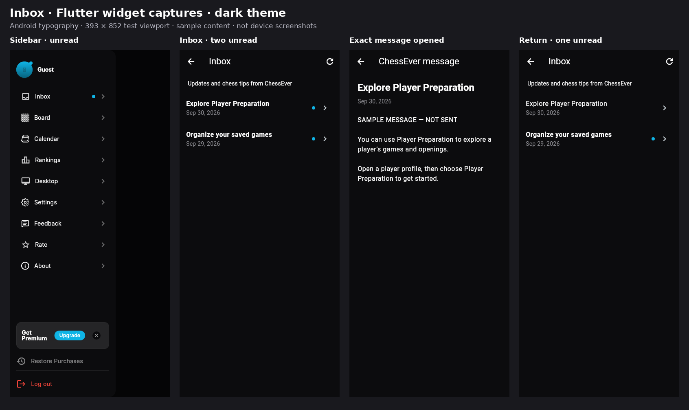
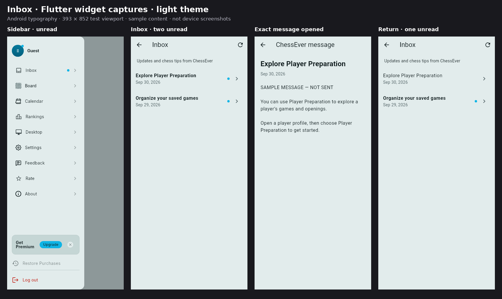

# Inbox review previews

These are captures of the implemented Flutter widgets in widget tests, not redrawn mockups and not installed-device screenshots. Each image shows the shared drawer, Inbox with two unread messages, the first message opened, and the returned list with only the second message unread.

- Viewport: 393 x 852 logical pixels, Android Material typography and loaded Material icons; app InterDisplay assets loaded for existing explicit typography.
- Widget test environment's Ahem fallback was replaced with Android Roboto for the captures, and the debug banner hidden. Production application code was not changed for capture.
- Sources/caches are labeled local doubles; message copy is illustrative and has not been sent.
- Two screenshot-flow tests passed, asserting drawer/list do not mark, exact-message opening marks only that message, and shared unread state remains while the second message is unread.
- Physical Android/iOS layout, safe areas, font scaling, native SQLite persistence, hosted Supabase integration and OS badge behavior are not proven by these captures.

## Dark theme

## Light theme

Operational activation remains separately gated; see [Inbox contract and device checklist](../phone_inbox.md).
